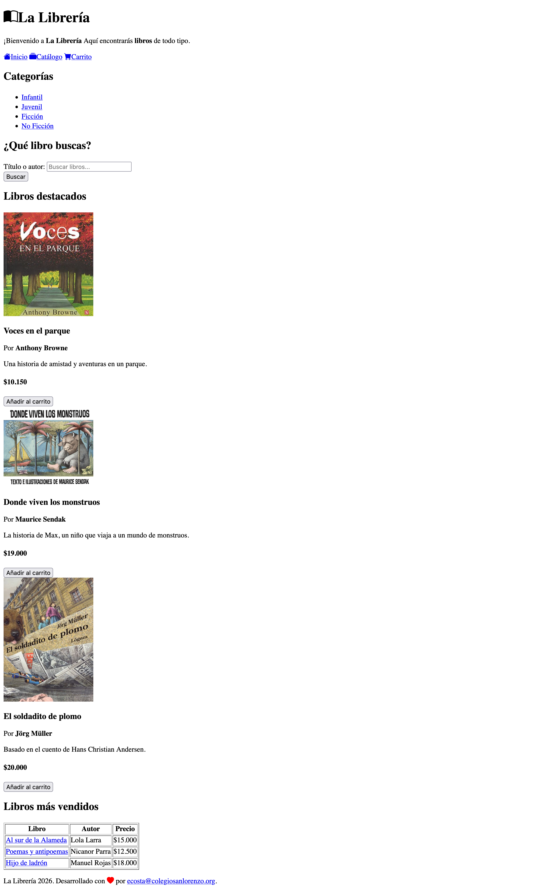

# La Librería

**La Librería** es un sitio web estático de una librería ficticia, desarrollado con HTML. Su propósito es presentar una estructura básica de proyecto web, organizada de manera clara y escalable.

## Resultado final



## Estructura del proyecto

A continuación se presenta la estructura general de archivos y carpetas del proyecto:

```
.
├── 📁 pages/
├── 📁 resources/
│   ├── 📁 images/
│   │   ├── donde-viven-los-monstruos.png
│   │   ├── el-soldadito-de-plomo.png
│   │   └── voces-en-el-parque.png
│   └── resultado.png
├── 📁 static/
│   ├── 📁 css/
│   │   └── styles.css
│   ├── 📁 fonts/
│   ├── 📁 icons/
│   ├── 📁 images/
│   │   ├── donde-viven-los-monstruos.png
│   │   ├── el-soldadito-de-plomo.png
│   │   └── voces-en-el-parque.png
│   └── 📁 js/
│       └── script.js
├── .gitignore
├── index.html
└── README.md
```

## Descripción de archivos y carpetas

| Archivo / Carpeta | Descripción |
| --- | --- |
| `pages/` | Carpeta reservada para futuras páginas adicionales del sitio web. |
| `resources/images/` | Carpeta que almacena imágenes de apoyo o recursos gráficos utilizados como referencia dentro del proyecto. |
| `resources/resultado.png` | Imagen de referencia que muestra el resultado final esperado del sitio web. |
| `static/css/styles.css` | Archivo CSS principal que define la presentación visual y los estilos del sitio web. |
| `static/fonts/` | Carpeta destinada a las fuentes tipográficas utilizadas en el sitio web. |
| `static/icons/` | Carpeta destinada a los íconos utilizados en la interfaz del sitio web. |
| `static/images/` | Carpeta que contiene las imágenes utilizadas directamente en el sitio web. |
| `static/js/script.js` | Archivo JavaScript principal que incorpora la funcionalidad e interacción del sitio web. |
| `.gitignore` | Archivo que especifica los archivos y carpetas que no deben incluirse en el control de versiones. |
| `index.html` | Archivo HTML principal del sitio web. |
| `README.md` | Archivo de documentación general del proyecto. |
