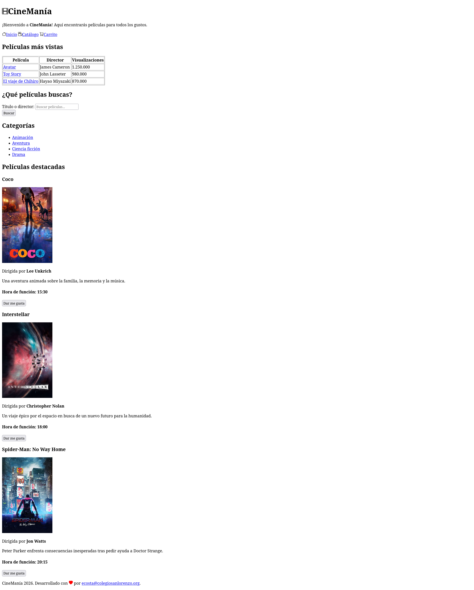

# CineManía

**CineManía** es un sitio web estático de una plataforma de streaming de películas ficticia, desarrollado con HTML. Su propósito es presentar una estructura básica de proyecto web, organizada de manera clara y escalable.

## Resultado final



## Estructura del proyecto

A continuación se presenta la estructura general de archivos y carpetas del proyecto:

```
.
├── 📁 pages/
├── 📁 resources/
│   ├── 📁 icons/
│   │   ├── camera-reels.svg
│   │   ├── cart.svg
│   │   ├── film.svg
│   │   ├── heart-fill.svg
│   │   └── house.svg
│   ├── 📁 images/
│   │   ├── coco.jpg
│   │   ├── interstellar.jpg
│   │   └── spider-man-no-way-home.jpg
│   └── resultado.png
├── 📁 static/
│   ├── 📁 css/
│   │   └── styles.css
│   ├── 📁 fonts/
│   ├── 📁 icons/
│   │   ├── camera-reels.svg
│   │   ├── cart.svg
│   │   ├── film.svg
│   │   ├── heart-fill.svg
│   │   └── house.svg
│   ├── 📁 images/
│   │   ├── coco.jpg
│   │   ├── interstellar.jpg
│   │   └── spider-man-no-way-home.jpg
│   └── 📁 js/
│       └── script.js
├── .gitignore
├── index.html
└── README.md
```